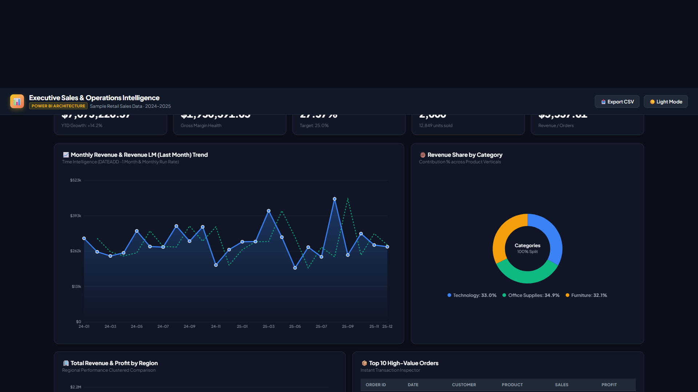
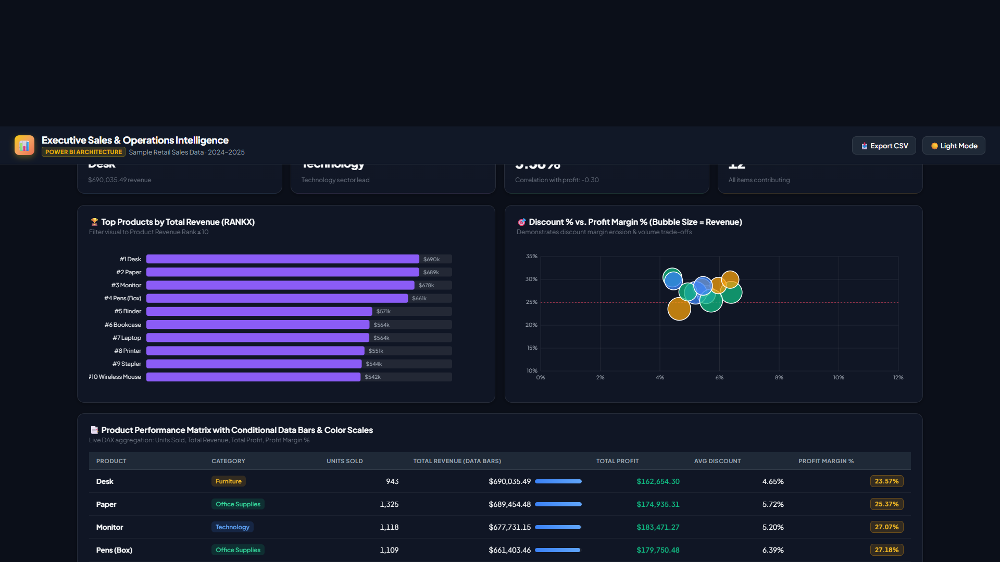
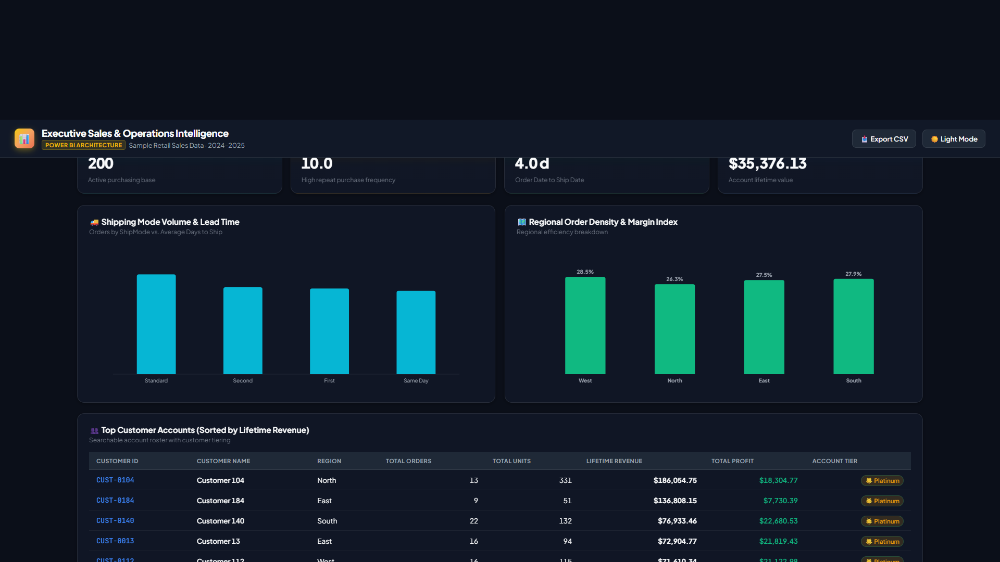
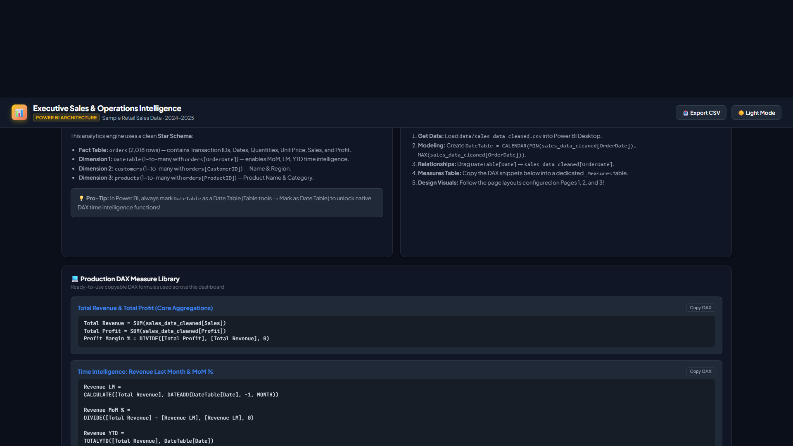

# Power BI Dashboard — Build Guide

Power BI Desktop is a Windows application and can't be run or export a `.pbix` file
from this environment. Instead, this folder gives you everything needed to build the
real thing in ~15 minutes, **plus** a fully working interactive dashboard
(`business_dashboard.html`) you can open right now in any browser as a live preview
of the same KPIs and charts.

## 1. Get the data in
1. Open **Power BI Desktop** → **Get Data** → **Text/CSV**.
2. Load `data/sales_data_cleaned.csv`.
3. In Power Query Editor, confirm data types: `OrderDate`/`ShipDate` → Date,
   `Sales`/`Profit`/`UnitPrice` → Decimal Number, `Quantity` → Whole Number,
   `Discount`/`ProfitMargin` → Percentage. Click **Close & Apply**.

## 2. Build a Date table (best practice for time intelligence)
**Modeling → New Table:**
```dax
DateTable = CALENDAR(MIN(sales_data_cleaned[OrderDate]), MAX(sales_data_cleaned[OrderDate]))
```
Then add columns:
```dax
Year = YEAR(DateTable[Date])
MonthName = FORMAT(DateTable[Date], "MMM YYYY")
MonthNum = MONTH(DateTable[Date])
```
Mark it as a **Date Table** (Table tools → Mark as Date Table), then relate
`DateTable[Date]` (1) → `sales_data_cleaned[OrderDate]` (many).

## 3. Core DAX measures
Create these in a new **Measures** table (Modeling → New Table → blank, or just add
measures directly on the fact table):

```dax
Total Revenue = SUM(sales_data_cleaned[Sales])

Total Profit = SUM(sales_data_cleaned[Profit])

Total Orders = DISTINCTCOUNT(sales_data_cleaned[OrderID])

Total Units Sold = SUM(sales_data_cleaned[Quantity])

Profit Margin % = DIVIDE([Total Profit], [Total Revenue], 0)

Average Order Value = DIVIDE([Total Revenue], [Total Orders], 0)

Average Discount % = AVERAGE(sales_data_cleaned[Discount])

-- Time intelligence (requires the DateTable relationship above)
Revenue LM =
CALCULATE([Total Revenue], DATEADD(DateTable[Date], -1, MONTH))

Revenue MoM % =
DIVIDE([Total Revenue] - [Revenue LM], [Revenue LM], 0)

Revenue YTD =
TOTALYTD([Total Revenue], DateTable[Date])

-- Ranking measure, useful for a "Top N Products" visual with a slicer
Product Revenue Rank =
RANKX(ALL(sales_data_cleaned[Product]), [Total Revenue], , DESC)
```

## 4. Suggested report layout
- **Page 1 — Executive Overview**
  - KPI cards: Total Revenue, Total Profit, Profit Margin %, Total Orders, Average Order Value
  - Line chart: Total Revenue by MonthName (from DateTable) with Revenue LM as a second line
  - Clustered bar: Total Revenue by Region
  - Donut chart: Total Revenue by Category
  - Slicers: Region, Category, Year
- **Page 2 — Product Performance**
  - Table/matrix: Product, Category, Total Units Sold, Total Revenue, Profit Margin %
  - Bar chart: Top 10 products by Total Revenue (filter visual to Product Revenue Rank ≤ 10)
  - Scatter chart: Average Discount % (x) vs Profit Margin % (y), bubble size = Total Revenue
- **Page 3 — Customer & Regional Detail**
  - Map or filled map by Region (if you add lat/long, or use a simple bar as a substitute)
  - Table: Customer, Region, Total Revenue, Total Orders
  - Card: Average Discount %

## 5. Conditional formatting / KPIs
- On the Product table, apply **Conditional formatting → Data bars** to Total Revenue.
- On Profit Margin %, apply a **color scale** (red → yellow → green) so low-margin
  products stand out immediately — mirrors the conditional formatting already applied
  in `excel/sales_dashboard.xlsx`.

## 6. Publish / share
**File → Publish → Publish to Power BI** (requires a Power BI account) to get a
shareable web link, or export the finished report as PDF for a quick static share.

---
### Interactive Dashboard Previews (business_dashboard.html)

Open `business_dashboard.html` in any browser for a live, filterable dashboard built on the same cleaned dataset.

#### Page 1 — Executive Overview


#### Page 2 — Product Performance


#### Page 3 — Customer & Regional Detail


#### Page 4 — DAX & Modeling Architecture


